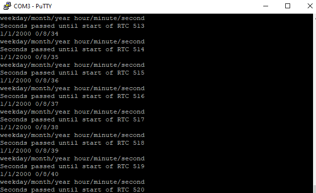

# Zephyr stm32 RTC how to
Zephyr provides rtc driver support for stm32 microcontrollers. Counter api is masked to rtc functions. RTC functions are present in counter_ll_stm32_rtc.c driver source file. Driver file is modified with few instructions which suit's our appliation.  

 <b>Note</b>: Not all stm32 microcontroller series offer RTC. Also the counter api dosen't provide support for all the RTC functionality. You can take it as a getting started reference and build your application on top of it.

 In device tree overlay file toggle.overlay rtc node is activated. An another parameter, clock-frequency can be added to rtc node. Its defined in \zephyr\dts\bindings\rtc\rtc.yaml file. LSI 32KHz clock is supplied to RTC. Its not actived in the device tree, rather counter_ll_stm32_rtc.c file contains LL instructions which activates the LSI. 

 Output of main.c instruction below can be viewed on UART serial terminal. I used PUTTY baudrate is set 115200 and COM port can be verified from Device Manager. 

<h2>Folders</h2>
<ol>
  <li>app     - Contains sources and overlay file</li>
  <li>reference file     - Contains counter_ll_stm32_rtc.c modified driver file</li>
</ol>

<h3>Download driver with west and initialize workspace</h3>
<code># Download main branch
west init -m https://github.com/UsmanAliButt/ZephyrRTOS.git --mr main ZephyrRTOS
# Zephyr local repository needs to be updated to dowload zephyr support 
# See west.yml in project for proper dependencies
cd "stm32 RTC with zephyr"
west update</code>

 update will look in west.yml file what to do? It simply contains information regarding packages which needs to be downloaded
and necessary for our project. An out of tree project will be created. If you dosent like out of tree project, simply add the main.c 
file in your zephyr tree and update the counter_ll_stm32_rtc.c file. This way space in your machine can be saved.  
 To enable RTC driver include in prj.conf 
<code>
	CONFIG_COUNTER=y
	CONFIG_COUNTER_RTC_STM32=y
</code> 
