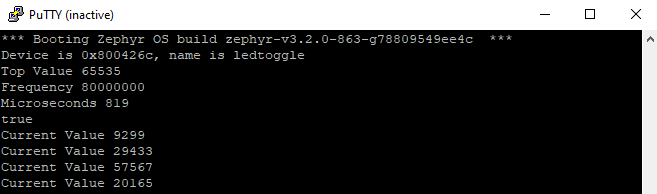

# Zephyr simple driver "toggleled"
Adding a support to zephyr project. Driver development is not well documented and explained in zephyr project. So i decided to create a simple out of tree driver and make is public.
  Just one GPIO pin is utilized here. Tested on physical hardware STM32 nucleol432kc board. GPIO pin-3 of module has default led connected to it.
  Output of main.c instruction below can be viewed on UART serial terminal. I used PUTTY baudrate is set 115200 and COM port can be verified from Device Manager. 
<code>printk("Device is %p, name is %s\n", dev, dev->name);</code>

<h2>Folers</h2>
<ol>
  <li>app     - Contains sources and overlay file</li>
  <li>drivers - Contains driver sources</li>
  <li>dts     - Contains device tree bindings</li>
  <li>include - Contains headers files</li>
  <li>zephyr  - Contains module setup</li>
</ol>

<h3>Download driver with west and initialize workspace</h3>
<code># Download main branch
west init -m https://github.com/UsmanAliButt/zephyr-simple-driver-toggleled.git --mr main zephyr-simple-driver-toggleled
# Zephyr local repository needs to be updated to dowload zephyr support and dependent modules 
# See west.yml in project for proper dependencies
cd zephyr-simple-driver-toggleled
west update</code>

 prj.conf file is empty. Since GPIO's are already enabled in default board conf so not required to be enabled on prj conf. 
