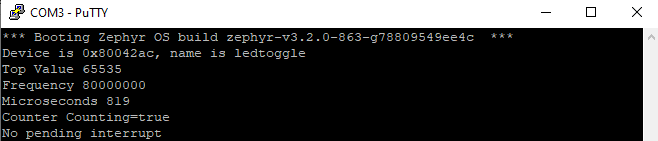

# Zephyr stm32 microcontroller timer interrupt with NVIC
This example is add-on to 
 [simple zephyr toggleled custom driver](https://github.com/UsmanAliButt/zephyr-simple-driver-toggleled)
 [zephyr counter with stm32](https://github.com/UsmanAliButt/ZephyrRTOS/tree/main/zephyr%20counter%20with%20stm32)
  Zephyr until today 1 February 2023 dosent list any timer interrupt with NVIC example for stm32 cortex-m microcontrollers. Timers interrupts and how to originate and control them is no where found.
 However NVIC support is present in driver files. For timers stm32 default HAL and LL libraries are present in zephyr tree. So in this example I decided to activate timer update interrupt and do some thing useful. 
 In counter_ll_stm32_timer.c NVIC is initialized by default, but timer interrupt is not activated, NVIC isr is also defined but call back is not populated (kind of weird).

 To activate timer interrupt and jumping in to ISR i made small changes in counter_ll_stm32_timer.c also an extern variable is defined in counter.h which is updated in counter_ll_stm32_timer.c and accessed in main.c source file.

<h2>Working</h2>
 Initial toggle led set to 0.5 seconds (500). 819 microseconds taken by timer-6 (16-bit max count 65535) to overflow/update at 80MHz frequency.
 1221 * 819 micro seconds = 0.99 seconds
 After 1 second decrease toogle time 50 points or 20% in steps, eventually at 0 rollup to 0.5 seconds with 20% increase in steps.
 <b>In simple words: Update toggle time after every second. Where toggle time range is between 0 - 0.5 seconds. You can see led fading and unfading</b>

  Output of program initialization can be viewed on UART port at 115200 bps. I used putty.

<h2>Folers</h2>
<ol>
  <li>app     - Contains sources and overlay file</li>
  <li>drivers - Contains driver sources</li>
  <li>dts     - Contains device tree bindings</li>
  <li>include - Contains headers files</li>
  <li>zephyr  - Contains module setup</li>
  <li>reference files - Contains origial counter.h and counter_ll_stm32_timer.c edited files. You can replace them in your zephyr tree or use them just for learning purposes</li>
</ol>
  View main.c and counter_ll_stm32_timer.c for other parameter and device checks. Stm32 LL libraries are used to activate timer interrupts.    
<h3>Download driver with west and initialize workspace</h3>
<code># Download main branch
west init -m https://github.com/UsmanAliButt/ZephyrRTOS.git --mr main ZephyrRTOS
# Zephyr local repository needs to be updated to dowload zephyr support and dependent modules 
# See west.yml in project for proper dependencies
cd ZephyrRTOS/zephyr stm32 timer interrupt with NVIC
west update</code>
